# sorting-hat 


The `sorting-hat` Quarto extension selectively includes or excludes code blocks based on programming language. Like the magical Sorting Hat, it sorts your code blocks into the houses (languages) you want to see. This is useful when you want to create language-specific versions of your documents from a single source.

## Installation

To install the `sorting-hat` Quarto extension, follow these steps:

1. Open your terminal.
2. Execute the following command:

```sh
quarto add coatless-quarto/sorting-hat
```

This command will download and install the Quarto extension under the `_extensions` subdirectory of your Quarto project. If you are using version control, ensure that you include this directory in your repository.

## Usage

Add the `sorting-hat` filter to your document's YAML front matter alongside the desired configuration options. For example, to keep only Python code blocks:

```yaml
---
title: "My Document"
filters:
  - sorting-hat
extensions:
    sorting-hat:
        keep: python
---
```

All code blocks not written in Python will be removed from the document.

## Export Mode (nbdev-style)

When you want to export only explicitly marked code blocks (e.g., for `ripper`), enable export mode. In export mode, the filter removes every code block that does not have `#| export`. This happens before `ripper`, so only approved blocks are exported. Language filtering options are ignored in export mode.

Enable export mode with document parameters or an environment variable:

```yaml
---
title: "My Document"
filters:
  - sorting-hat
  - ripper
params:
  export: true
---
```

Or run with `QUARTO_EXPORT=1`.

Mark exportable blocks like this:

```python
#| export
def clean_data(df):
    return df.dropna()
```

Blocks with `#| export: false` (or no export directive) are removed in export mode.

## Configuration Options

### Global Options

| Option | Type | Description | Default |
|--------|------|-------------|---------|
| `keep` | string or list | Languages to include (all others filtered) | none |
| `remove` | string or list | Languages to exclude (all others kept) | none |
| `action` | string | How to handle filtered code: `"remove"` or `"collapse"` | `"remove"` |
| `placeholder` | string | Text to show when content is removed (use `{language}` for language name) | none |
| `placeholder-style` | string | CSS styles for placeholder | default styling |
| `verbose` | boolean | Enable debug logging | `false` |


#### Notes

- If you specify both `keep` and `remove`, the `keep` option takes precedence
- Code blocks without a language class are always kept
- The filter only affects code blocks, not inline code

### Cell-Level Attributes

Add to individual code cells to override global settings:

| Attribute | Description |
|-----------|-------------|
| `#\| sorting-hat: keep` | Always keep this cell |
| `#\| sorting-hat: remove` | Always remove this cell |
| `#\| sorting-hat: collapse` | Always collapse this cell |

## Examples of Configuration

### Keep Specific Languages

Use the `keep` option to specify which languages should be included (all others will be removed):

```yaml
---
title: "My Document"
format: html
filters:
  - sorting-hat
extensions:
  sorting-hat:
    keep: python
---
```

Or keep multiple languages:

```yaml
---
title: "My Document"
format: html
filters:
  - sorting-hat
extensions:
  sorting-hat:
    keep:
      - python
      - bash
---
```

### Remove Specific Languages

Use the `remove` option to specify which languages should be excluded (all others will be kept):

```yaml
---
title: "My Document"
format: html
filters:
  - sorting-hat
extensions:
  sorting-hat:
    remove: r
---
```

Or remove multiple languages:

```yaml
---
title: "My Document"
format: html
filters:
  - sorting-hat
extensions:
  sorting-hat:
    remove:
      - r
      - julia
---
```

### Cell-Level Overrides

Override global settings for specific cells:

````markdown
---
filters: [sorting-hat]
extensions:
  sorting-hat:
    keep: python
---

```{r}
#| sorting-hat: keep
# This R cell is kept despite global Python-only setting
cat("Hello from R\n")
```

```{python}
#| sorting-hat: remove
# This Python cell is removed despite being in keep list
print("This won't appear")
```
````

### Placeholder Text

Show a message where content is removed:

```yaml
extensions:
  sorting-hat:
    remove: r
    placeholder: "[{language} code hidden]"
    placeholder-style: "color: #888; font-style: italic;"
```

### Collapse Instead of Remove

Hide code in expandable sections:

```yaml
extensions:
  sorting-hat:
    remove: r
    action: collapse  # Code becomes clickable to expand (in HTML output)
```

### Debug Mode

Enable debug logging to see which code blocks are being processed:

```yaml
---
title: "My Document"
format: html
filters:
  - sorting-hat
extensions:
  sorting-hat:
    keep: python
    debug: true
---
```
